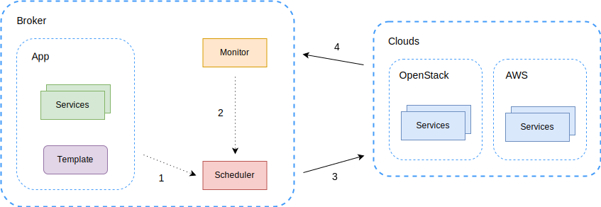
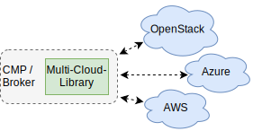
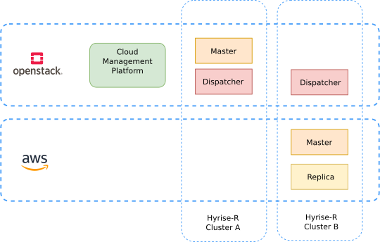

# SLA-aware Multi-Cloud Application-Broker

:memo: Downloads: 
[Presentation](https://github.com/janmattfeld/broker/releases/download/print/presentation.pdf) | 
[Thesis](https://github.com/janmattfeld/broker/releases/download/print/online.pdf)

Wir versetzen Cloud-Kunden in die Lage, ihre Anforderungen **anbieter- und technikunabhängig** zu formulieren und durchzusetzen. Unsere Lösung automatisiert die Einhaltung von **Datenschutz-, Qualitäts- und Kostenzielen**. Damit ist das Projekt einzigartig und ergänzt die bisherigen Beiträge im EU-geförderten Forschungsprojekt [SSICLOPS](https://ssiclops.eu/).


Als Lösungsvorschlag entwickeln wir einen Multi-Cloud-Anwendungs-Broker auf den Ebenen IaaS und CaaS.



Wir diskutieren den Aufwand der Cloud-Teststellungen und den Einsatz der Multi-Cloud-Bibliothek [Apache Libcloud](https://libcloud.apache.org/).



Dabei dient das [TOSCA-Simple-Schema](http://docs.oasis-open.org/tosca/TOSCA-Simple-Profile-YAML/v1.1/TOSCA-Simple-Profile-YAML-v1.1.html) zur Anwendungs- und SLA-Spezifikation (Auszug):

```yaml
services:
  - role: master
    depends_on:
      - dispatcher
    availibility: !import policy.availibility.default.yaml
    provider:
      docker:
        image: hyrise/dispatcher:docker
        command:
          - ./start_dispatcher
          - '{{dispatcher.port}}'
      openstack:
        image: Hyrise-R Dispatcher
        command: |
          #cloud-config
```

Die Leistungsfähigkeit der Lösung demonstrieren wir anschließend in einem Testaufbau mit [OpenStack](https://github.com/janmattfeld/DockStack), AWS, Docker und [Hyrise-R](https://github.com/janmattfeld/hyrise_nvm).



## Demo

[](https://asciinema.org/a/ybXZmwKpOoSI6UP8gac868LYv)
